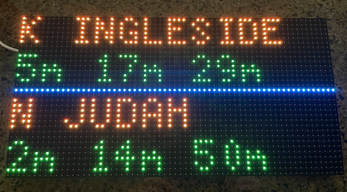

# CircuitPython_TransitPredictionsApp
Prediction App That Displays Transit Predictions on a Display Panel

## Materials ##
- **A display** (this example uses the [64x32 RGB LED Matrix - 5mm pitch](https://www.adafruit.com/product/2277))
- **A controller board** (this example uses the [Adafruit Matrix Portal S3](https://www.adafruit.com/product/5778))
- **A USB-C data cable**
- **A USB-C 5V power plug**

## Instructions ##

1. Connect the board to the LED display as shown [here](https://learn.adafruit.com/adafruit-matrixportal-s3/prep-the-matrixportal)
2. Follow the instructions [here](https://learn.adafruit.com/adafruit-matrixportal-s3/install-circuitpython) to install CircuitPython on the Portal S3, using the USB-C data cable
3. Download the Adafruit 8.x CircuitPython bundle [here](https://circuitpython.org/libraries)
4. Download the font to be used from [here](https://opensource.apple.com/source/X11fonts/X11fonts-14/font-misc-misc/font-misc-misc-1.1.2/5x7.bdf.auto.html) backup in bundle [here](https://www.cl.cam.ac.uk/~mgk25/ucs-fonts.html)
5. Go to the 511.org website and request an API token using the form [here](https://511.org/open-data/token), this shouldn't take long
6. Open the `settings.toml` file and input the following values (the rest can be left as a working example for San Francisco's Powell station predictions for now):
    - `CIRCUITPY_WIFI_SSID` the 2.4GHz network to which the board will connect
    - `CIRCUITPY_WIFI_PASSWORD` the network password
    - `511_API_KEY` (obtained from step 4)
7. Make a `fonts` folder in the root directory of the board and copy the font file into it.
8. Make a `lib` folder (if it does not exist yet) in the root directory of the boardCopy the following **Adafruit 8.x CircuitPython** libraries into it:
    - `adafruit_bitmap_font` (copy the folder)
    - `adafruit_display_shapes` (copy the folder)
    - `adafruit_display_text` (copy the folder)
    - `adafruit_matrixportal` (copy the folder)
    - `adafruit_datetime.mpy` (copy the file)
    - `adafruit_requests.mpy` (copy the file)
9. Copy all the python files from this repo as well as the toml file onto the board's root directory and approval overwrite when asked
10. Safely eject the board from the computer and move the cable from the computer to the USB-C power plug

### The final result should look like this: ###

## Troubleshooting Steps ##
It's sometimes the case the board will not go into bootloader mode. Follow the instructions [here](https://learn.adafruit.com/adafruit-matrixportal-s3/factory-reset) to factory reset the unit and try the 'double tap' trick again to flash CircuitPython onto the board
Transit examples do not run 24/7 so if no results are displayed this might be run too late at night and it's best to come back to it the next day

## Next Steps ##

- The values in the `settings.toml` file can be changed based on the top and routes that are of interest now that the board and sign are up and running
- Other displays can be used and appearances can be customized in the `transit_predictions_app_io.py` file for the display
- Other APIs or regions can be used in the `transit_predictions_app_io.py` for sources

## References ##
- https://511.org/open-data/transit